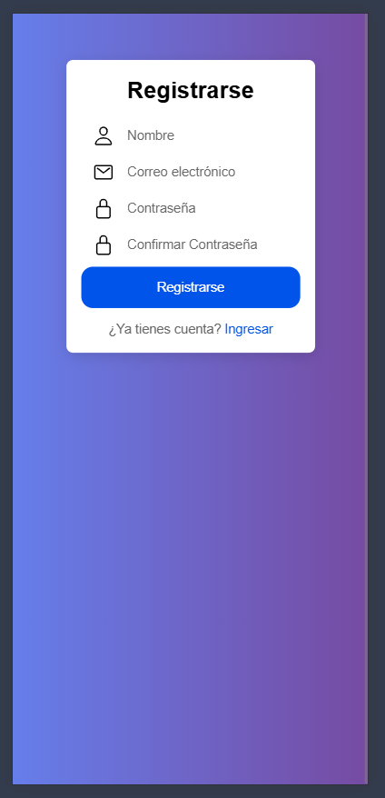
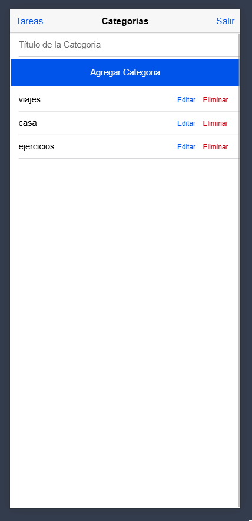

# to-do-app

APP demo for To Do tasks and categories

### Generar los environments de producción

Previo a compilar la app, se debe tener el archivo **.env** con las variables requeridas, es necesario generar los archivos de configuración de producción. Esto se hace con el siguiente comando:

```bash
npx ts-node tools/env-generator.ts
```

✅ 1. Requisitos previos
Instalado:

- Node.js
- Ionic CLI:
```bash
npm install -g @ionic/cli
```

✅ 2. Instalar Capacitor y configurar Android
```bash
ionic build
npx cap add android
npx cap sync
```

✅ 3. Abrir el proyecto en Android Studio
```bash
npx cap open android
```

✅ 4. Conectar tu teléfono Android
- Conectar teléfono vía USB
- Asegúrar que la depuración USB esté activada
- Verificar que sea reconocido:
```bash
adb devices
```

✅ 5. Compilar e instalar la app
Desde Android Studio:

- Hacer clic en Run ▶️ (Selecciona dispositivo físico como destino)
- La app se compilará y se instalará en el teléfono

🔄 Reinstalar app tras cambios
```bash
ionic build
npx cap copy android
npx cap open android
```

✅ 6. Probar la app








### Author

- [@Raul Bolivar Navas](https://github.com/raulrobinson/to-do-app)

### License

This project is licensed under the MIT License - see the [LICENSE](LICENSE) file for details.
